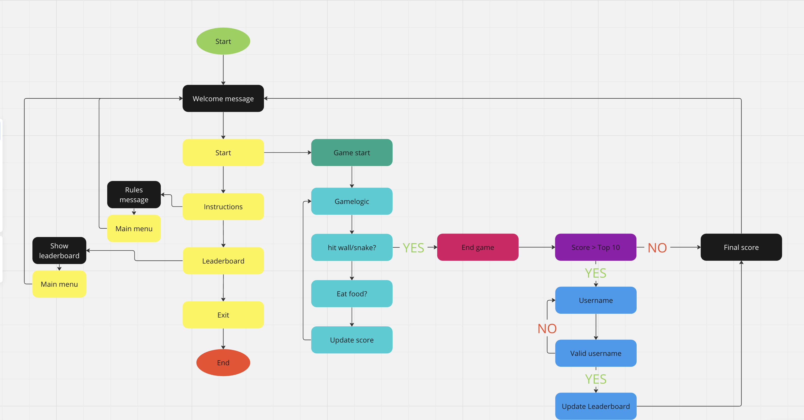

# [SNAKE GAME](https://snake-eat-food-game-b47e36d72bf2.herokuapp.com)

This is a simple terminal based snake game implemented in Python. which runs in the Code Institue mock terminal on Heroku The gane features a snake that grows when it. The games features a snake that grows when it eats food and dies when it collides with the wall or itself. High Scores are tracked and stored in Google Sheets spreadsheet.

### Flowchart

To follow best practice, a flowchart was created for the app's logic,
and mapped out before coding began using a free version of
[Lucidchart](https://www.lucidchart.com/pages/ER-diagram-symbols-and-meaning) and/or [Draw.io](https://www.draw.io).

Below is the flowchart of the main process of this Python program. It shows the entire cycle of the program.

