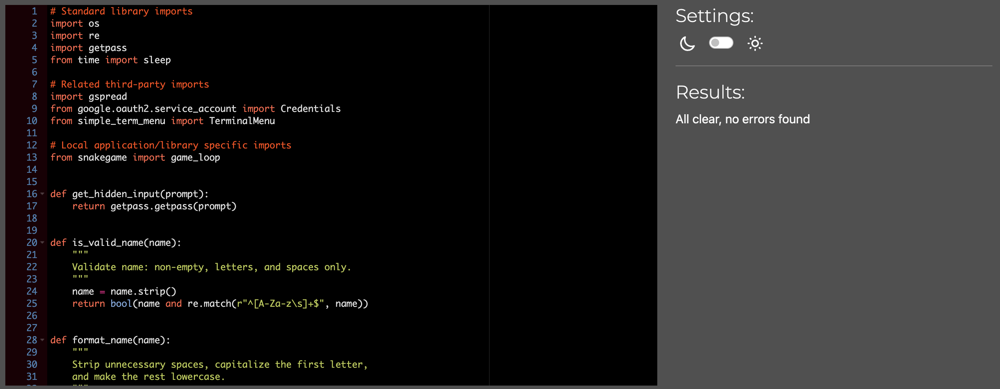
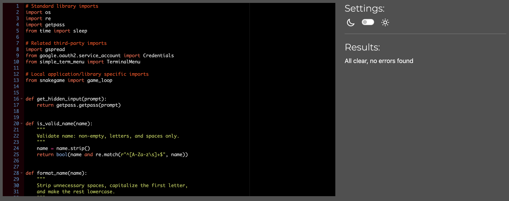

# Testing

Return back to the [README.md](README.md) file.

## Code Validation

### Python

I have used the recommended [PEP8 CI Python Linter](https://pep8ci.herokuapp.com) to validate all of my Python files.

| File | Screenshot | Notes |
| ---- | ---------- | ----- |
| run.py |  | Pass: No errors |
| snakegame.py |  | Pass: No errors

## Solved bugs

- **Game Loop Initialization from Menu**
    - ***Issue***: The game did not initiate a new loop when the 'Start' option was selected from the menu. This resulted in the game failing to restart after the initial playthrough, affecting the overall user experience and gameplay flow.

    - ***Solution***: Implemented the `update_variables()` function within the game loop. This function is now called at the end of each game cycle, effectively resetting the game state and preparing it for a new round. This update ensures that whenever a player selects 'Start' from the menu, the game initializes a fresh loop, allowing for continuous and uninterrupted gameplay.

- **Collision Detection with Walls and Self**
    - ***Issue***: The game initially lacked proper collision detection mechanisms for the snake. This resulted in two major issues: the snake could move outside the boundaries of the terminal (wall collision), and it could overlap with its own body without triggering a game over (self-collision).

    - ***Solution***: Implemented two distinct functions, `check_collision_with_wall()` and `check_collision_with_self()`, to address these issues. The `check_collision_with_wall()` function checks if the snake's head has collided with the terminal's boundaries. It returns True if the head's coordinates are outside the permissible range, indicating a collision with the wall. The check_collision_with_self function, on the other hand, checks if the snake's head has collided with any part of its body. It returns True if the head's coordinates match any of the body segment coordinates, indicating a self-collision. These functions significantly improved the game's mechanics by ensuring that collisions with walls or the snake's own body correctly result in a game over, enhancing the game's challenge and playability.

- **Leaderboard Update and Score Sorting**
    - ***Issue***: The game initially faced challenges in updating the leaderboard with high scores. The requirement was to maintain a scoreboard that records all scores and then update the leaderboard with the top 10 scores from the scoreboard. However, the process of sorting and updating the leaderboard was not functioning as intended.

    - ***Solution***: Implemented a solution using Google Sheets' built-in SORT function. The formula `=SORT(scoreboard!A1:B100,2,FALSE)` was used within the Google Spreadsheet. This formula sorts the range `A1:B100` from the 'scoreboard' sheet based on the values in the second column (which contains the scores), in descending order (FALSE parameter for descending sort). This approach ensures that the highest scores are always at the top of the sorted range. The leaderboard then pulls data from this sorted range, displaying only the top 10 scores. This solution effectively automated the process of updating the leaderboard with the highest scores, ensuring that the game's competitive aspect is maintained with an accurate and up-to-date leaderboard.

- **Snake Growth Mechanism**
    - ***Issue***: In the initial implementation of the snake game, there was a bug related to the snake's growth mechanism. When the snake consumed food, it was expected to grow in length by adding a new segment to its body. However, the snake's length remained constant regardless of the number of food items consumed, affecting the core gameplay and challenge of the game.

    - ***Solution***: The bug was resolved by modifying the `move_snake()` function. Previously, the function only moved the snake forward by adding a new head (the next position of the snake) and removing the tail (the last segment of the snake), which kept the snake's length constant. To implement the growth mechanism, a condition was added to check if the snake's head position coincided with the food's position (using the `check_food()` function). If the snake had consumed the food, the tail segment was not removed in that particular move, allowing the snake to grow in length. Additionally, the position of the food was randomized again after being consumed, to continue the gameplay. This solution effectively fixed the bug, allowing the snake to grow as intended upon consuming food, thus increasing the game's difficulty as the snake's length increased.

## Known bugs

- **Persistent Food Spawn Issue**

    - ***Description of the Bug***: In the current version of the snake game, players have reported a recurring issue where the food item occasionally spawns underneath the score display during gameplay. This overlap can cause confusion and disrupt the player's experience, as it obscures the view of the food item, which is a crucial element of the game.

    - ***Impact on Gameplay***: The bug affects the game's playability and user experience. When the food item spawns under the score display, it becomes partially or entirely invisible to the player. This can lead to missed opportunities for the snake to grow and can be particularly frustrating in high-score attempts, where every food item is vital for success.

## Manual Testing

Snake Game

- **Objectives**

    - The primary objective is to ensure that all game elements function correctly, with a specific focus on preventing console errors. These errors include invalid inputs like numbers, random letters, or special characters, which should not be accepted by the game.
    - Verify that all control flow statements (if-else) operate as intended, leading to the correct outcomes in the game.
    - Confirm that the player can navigate through the game menus, start a game, and that the game tracks the player's progress accurately.
    - Ensure that the game can be completed and that there are clear win/lose conditions.
    - Test the ability of the player to exit the game at any point without issues.

- **Testing Procedures**

    - Initially, the game's functionality will be tested to ensure that all scenarios, such as starting a game, eating food, and colliding with walls or the snake's body, lead to the expected outcomes.
    - Input validation will be rigorously tested. The game should only respond to the designated control keys, and any other inputs should be ignored without causing errors or unexpected behavior.
    - The game's response to incorrect scenarios, such as the snake colliding with itself or the wall, will be tested to ensure that the game over condition triggers correctly.
    - The visual aspects, including the rendering of the snake, food, and score, will be tested for clarity and correctness. The game's UI should be responsive and accurately reflect the current state of the game.
    - The testing will be conducted on the deployed version of the game, ensuring that the live environment reflects the expected behavior. All findings and observations will be meticulously recorded in the tables below, detailing each test and its outcome.
    - This structured approach to manual testing aims to cover all critical aspects of the snake game, ensuring a smooth and enjoyable experience for the players.

**Test Outcome**

| Element | Expected Outcome | Testing Performed | Result | Pass |
| ------- | ---------------- | ----------------- | ------ | ---- |
| Start Game | Game initiates correctly | Selected "Start" from the main menu | Game start | Pass |
| Game Controls | Snake responds to arrow key inputs | Used arrow keys to change snake direction | Snake responds to arrow key inputs | Pass |
| Eating Food | Snake grows and score increases | Guided snake to food items | Snake grows and score increases | Pass |
| Collision with Wall | Game ends when snake hits the wall | Directed snake towards the wall | Game ends | Pass |
| Collision with Self | Game ends when snake collides with itself | Directed snake to collide with its body | Game ends	| Pass |
| Score Display | Score updates correctly | Observed score while playing | Score updates correctly | Pass |
| Game Over Condition | Game over screen appears with the correct message | Triggered game over by collision | Game over score display | Pass |
| Leaderboard Display | Leaderboard shows correctly | Selected "Leaderboards" from the main menu | Leaderboard shows correctly | Pass |

**Menu Navigation**

- ***Test Description***
    - This test aims to verify the functionality of the menu navigation in the Snake Game. The test will focus on the ability to navigate through the menu options using the Up and Down arrow keys and selecting an option.

- ***Test Steps***
    - Launch the Snake Game.
    - Observe the main menu with options: "Start", "Instructions", "Leaderboards", "Quit".
    - Use the Up and Down arrow keys to navigate through the menu options.
    - Select each option by pressing the Enter key and observe the behavior.

- ***Expected Results***
    - The menu should display four options: "Start", "Instructions", "Leaderboards", "Quit".
    - Using the Up and Down arrow keys should highlight the respective menu options.
    - Pressing the Enter key on "Start" should initiate the game.
    - Pressing the Enter key on "Instructions" should display the game instructions.
    - Pressing the Enter key on "Leaderboards" should show the game's leaderboard.
    - Pressing the Enter key on "Quit" should exit the game and display a farewell message.

**Test Outcome**

| Action | Expected Result | Result | Pass/Fail |
| ------ | --------------- | ------ | --------- |
| Press Up Arrow | Highlight option above current selection | Highlight current selection | Pass |
| Press Down Arrow | Highlight option below current selection | Highlight current selection | Pass |
| Select "Start" | Begin the game | Game starts | Pass |
| Select "Instructions"	| Show game instructions | Show instructions | Pass |
| Select "Leaderboards"	| Display leaderboard | Show leaderboard | Pass |
| Select "Quit" | Exit game with farewell message | Display message |Pass |
